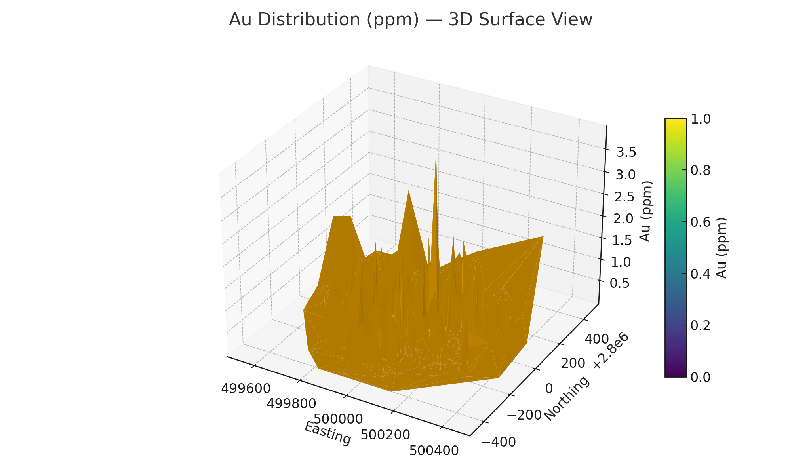
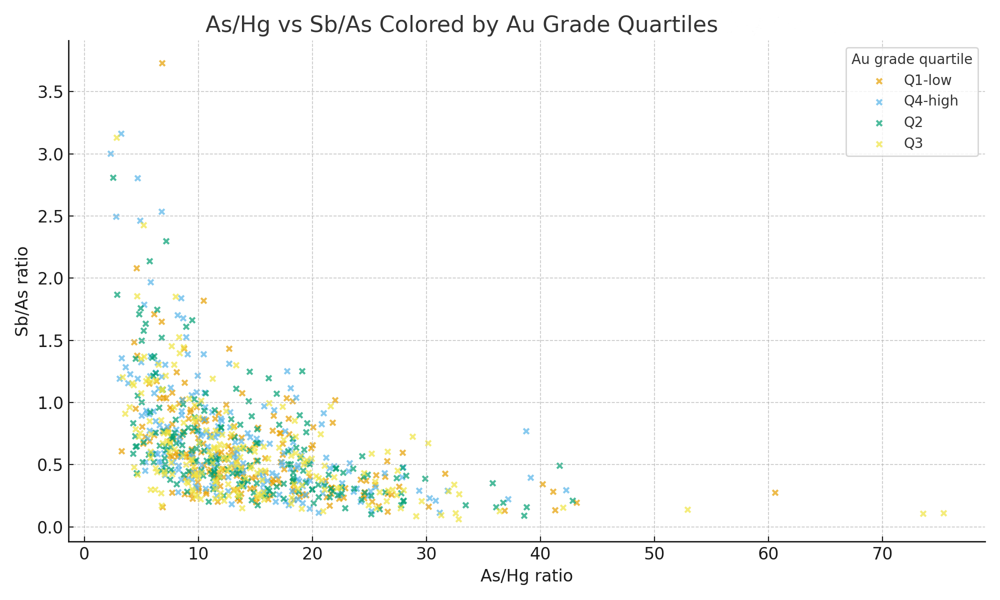
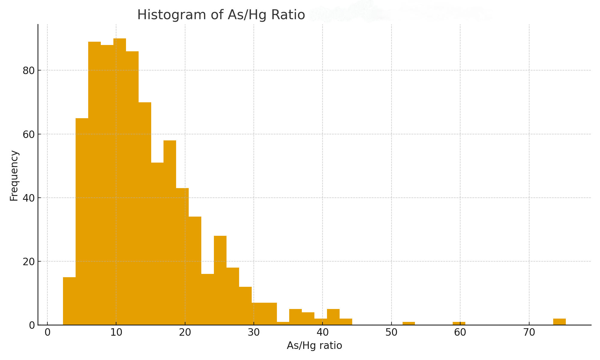

# 📊 4_Data_Analysis — Milestone 3 Final Outputs

**Project:** Gold Pathfinder ML — Shamkya
**Program:** MIT Emerging Talent — ELO2

This folder contains the **final analytical outputs** from Milestone 3.
These files summarize the geochemical vectoring work completed after exploratory analysis and visualization.

The content here is designed for:

* Communication with stakeholders
* Integration into Milestone 4 (Communicating Results)
* Reference for potential machine learning extensions

---

## 📁 Folder Structure

```text
4_data_analysis/
│
├── gold_distribution/
│   └── m3_gold_summary_statistics.csv
│
├── correlations/
│   ├── m3_correlation_matrix.csv
│   └── m3_gold_correlations.csv
│
├── ratio_tables/
│   ├── m3_pathfinder_ratios.csv
│   └── m3_ratio_vs_gold_correlations.csv
│
├── clusters/
│   ├── m3_map_clusters.png
│   ├── m3_3d_AsSbHg_index.png
│   ├── m3_interactive_3D_Au_distribution.html
│   ├── m3_interactive_3D_Au_surface.html
│   └── m3_interactive_3D_index_plus_highAu.html
│
├── spatial/
│   ├── m3_2d_contour_Au.png
│   └── m3_3d_surface_Au.png
│
└── analysis_summary.md
```

---

## 🪙 1. Gold Distribution Outputs

### 📄 Summary Statistics

`gold_distribution/m3_gold_summary_statistics.csv`

Key findings:

* Au is **highly skewed** due to nugget effect
* Most samples fall below 0.1 ppm
* High-grade intervals (up to 100 ppm) form localized spikes

---

### 📈 2D Gold Contour Map


---

### 🌐 3D Gold Surface Map



---

### 🔗 Interactive 3D Views

These HTML files open in any browser:

* [Interactive 3D Au Distribution](../assets/images/m3_interactive_3D_Au_distribution.html)
* [Interactive 3D Au Surface](../assets/images/m3_interactive_3D_Au_surface.html)
* [Interactive 3D Pathfinder Index + High Au](../assets/images/m3_interactive_3D_index_plus_highAu.html)

---

## 🧪 2. Correlation Analysis

### CSV Outputs

* `correlations/m3_correlation_matrix.csv`
* `correlations/m3_gold_correlations.csv`

### Key Insights

* **Sb** shows strongest positive correlation with Au
* **Ag** shows moderate positive correlation
* **Zn** is negatively correlated
* This matches classical hydrothermal/orogenic geochemical zoning

---

## 🧭 3. Pathfinder Ratio Tables

### **CSV Outputs**

* `ratio_tables/m3_pathfinder_ratios.csv`
* `ratio_tables/m3_ratio_vs_gold_correlations.csv`

### Ratios Used

| Ratio     | Purpose                                            |
| --------- | -------------------------------------------------- |
| **Sb/As** | Vectors toward mineralized core                    |
| **Cu/Zn** | Alteration indicator (weak signal in this dataset) |

---

### Visualizations





---

## 🧩 4. Clustering & Geochemical Zonation

### Cluster Map


### 3D Pathfinder Index


### Cluster Interpretation

| Cluster | Interpretation                  |
| ------- | ------------------------------- |
| **A**   | High-Au, high Sb/As → core zone |
| **B**   | Transitional zone               |
| **C**   | Distal Zn-rich halo             |

---

## 📘 5. Summary File

This folder contains full technical interpretation:
📄 `analysis_summary.md`

Use this for Milestone 4 to create reports and communication artifacts.

---

## 🎯 How To Use These Outputs

### For Milestone 4

* Select **4–6 figures** for your communication artifact
* Use the **interactive 3D HTML plots** for stakeholders
* Highlight **Sb/As ratio** as the clearest vectoring tool

### For Final Presentation

Include:

1. 2D Au contour
2. 3D Au surface
3. Cluster map
4. Pathfinder ratio scatter plot

---
